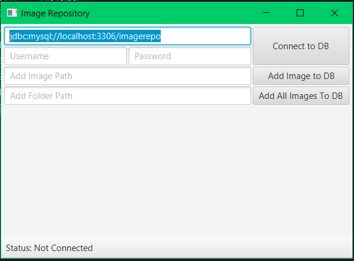

# Image_Repository-JAVA-JDBC-JAVAFX

Image Repository is a Java based project which uses JDBC (Java Database Connection) to connect to the database and JavaFX to create a GUI (Graphical User Interface).

Using the application, you can connect to a MySQL database, using "jdbc:mysql://localhost/3306/'Database Name'" as the domain, username and password, given you have the username and password to connect to it. Connecting to the database also creates a table "images" with three columns ("IMAGE_ID", "IMAGE", "IMAGE_CAPTION"). You can then add one/bulk/enormous amount of pictures to the database.

This is an individual project.

